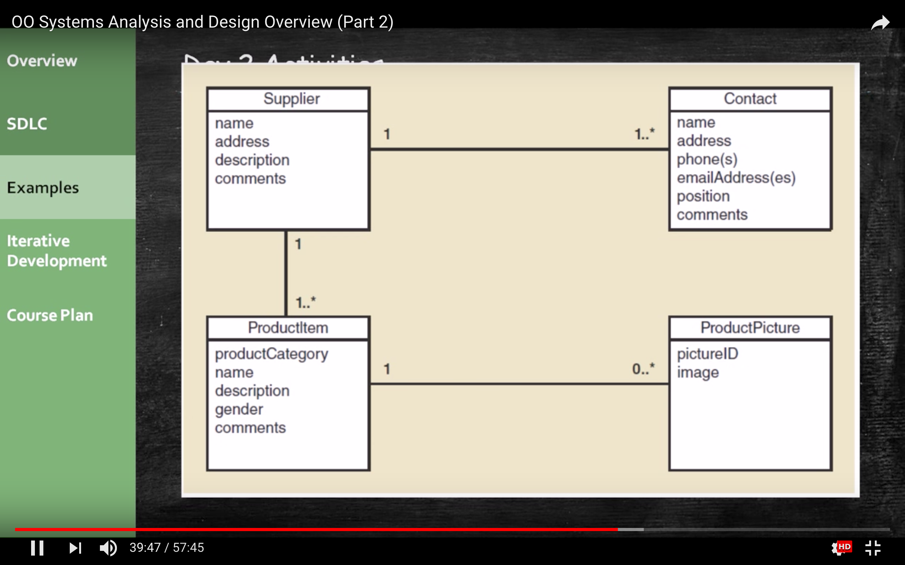
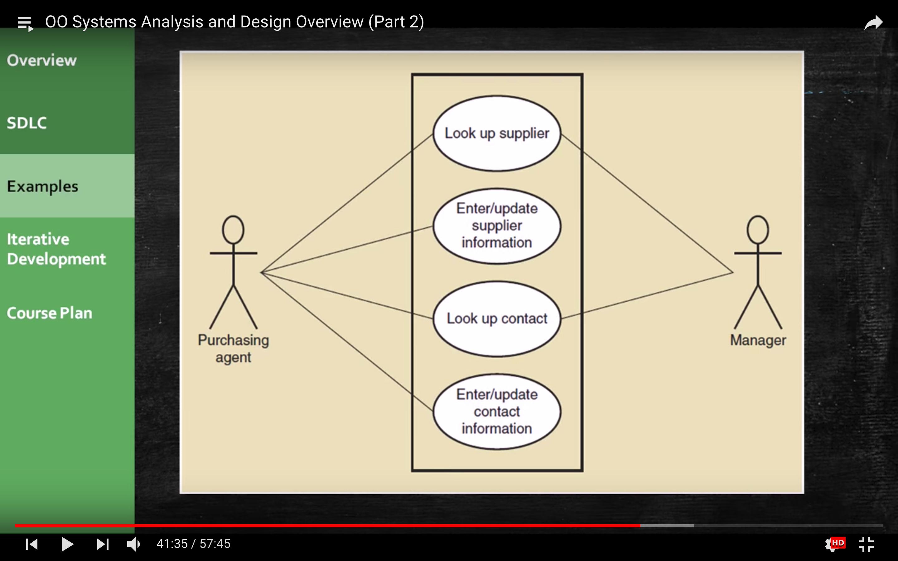

原文： https://www.youtube.com/watch?v=bnbwNe-w2U4&list=PL6XklZATqYx9dj72MKG6wLYjljeB2odra&index=7

###   System Vision Document

- Probelm Description
- System Capabilities
- Business benefits

### Day 1 Activities

#### Core Process 2：Plan the Project

1. Determine the major components (functional areas) that are needed.

   - Supplier Information subsystem
   - Product information subsystem

2. Define the iterations and assign each function to an iteration 

   - Decide to do Supplier subsystem first
   - Plan one iteration as it is small and straight forward

3. Determine team members and responsibilities

   Work Breakdown Structure-all the tasks that have to get done.

4. Estimating hours is kind of difficult sometimes, one technique you can use is **PERT.**

   ​	` Te = (O + 4R + P) / 6 `

5. Once you done with the PERT analysis, another useful technique is to take all the tasks from your work breakdown structure(schedule), and you create what`s called **Network Diagram**. This is where you show the process of all tasks how they connected to each another

### Day 2 Activities

#### Core Process 3 : Discover and Understand Details

- Do preliminary fact-finding to understand requirements.
- Develop a preliminary list of use cases and a use case diagram.
- Develop a preliminary list of classes and a class diagram.

1. A **use case** is basically how are people gonna to use the system, what are they expecting to get out of this system. **The things that people are going to use the system for.**

   

2. **Classes** are basically your objects, one of the things that you have to track up in the system. Each of the things have attributes. Brainstorm will think about all the stuff we have to track up and what the attributes are about that stuff.

3. Once we do that, we might create diagram, class diagram. This is not only showing  us the four objects that we have to track up or the four classes that we have to track up, but it`s also showing there are these relationship.

### Day 3 Activities

1. Core Process 3: Descover and Understand Details
   - Do in-depth fact-finding to understand requirements
   - Understand and document the detailed workflow of each use case
2. Core Process 4: Design System Components
   - Define the user experence with screens and reports
3. **Use cases:**
   - Look up supplier
   - Enter/ update supplier informaion
   - Lookup contact information
   - Enter/ update contract information

4. Workflow diagram shows us how are we going to use the system.

### Day 4: Activities

1. Core Process 4: Design System Components

   - Design the database (schema)
     - Table design
     - Key and index identification
     - Attribute types
     - Referential integrity
   - Design the system`s high level structure
     - Browser, Windows or Smart phone: OO or procefural
     - Architectural comfiguration (components)
     - Design class diagraam
     - Subsystem architectural design

   **Architectural Diagram**: show the relationship between all the components of system.

   

   **OO-Class Diagram**: a new Class Diagram shows the Attribute and the methods.

   

   ### Notes:

   1. Lots of design diagrams shown
      - Design in a complex activity with multiple levels
        - High level architectural
        - Low level architectural
      - One diagram builds on/complements another(Use case diagram drove what was it gonna be in the class diagram, class diagram drove what was it gonna be in our database, also drove what was it gonna be in our OO class diagram.)**We always start with Use case Diagram, first thing we are gonna learn about in analysis is Use cases.**
        - Not everything is diagrammed, especially for a small project. Pick and choose. (**How do we choose what need to be diagrammed? Anything you think needs clarification, anything that not inherently obvious, anything isn`t common sense.**)
   2. Programming is also done concruuently
      - You don`t design everything then code
      - You do some design, some coding, some design, some coding

   ### Day 5 Activities

   1. Core Process 4: Design System Components
      - Continue with design details
      - Proceed use case by use case
   2. Core Process 5: Build, Test, and Integrate System Components
      - Continue programming (build)
      - Build use case by use case
      - Perform unit and integration tests

   

   ### Day 6 Activities

   1. Core Process 6: Complete System Testing and Deploy System
      - Perform system functinoal testing
      - Perform user acceptance testing
      - Possibly deploy part of system(**One thing about the Agile/ Iteration Development is we deploy the system as it is available.**)

   ### First Iteration

   1. This was a 6 day iteration of small project
      - Most iterations are longer(2 to. 4 weeks)
      - This project might be 2 iterations
      - **Most projects have many more iterations**
   2. **End users need to be involved, particularly in day 1, 2, 3, 6(Acceptance Testing).**
   3. Day 4 and 5 involved design and programming concurrently.
      - **Lots of time was spent programming along with design(not emphasized here)**

   ### Where you are headed

   ---

   #### **Analysis**

   **Chapter 1: From Beginning to End**

   - Small project overview emphasizing analysis and design and iterative development

   **Online Chapter A: The Systems Analyst&**

   - More about the role of the systems analyst in systems development, including system concepts and careers

   **Chapter 2: Investigating System Requirements**

   - More about core process3: Systems analysis activities

   **Chapter 3: Use cases**

   - Techniques for Identifying and modeling use cases for systems analysis

   **Chapter 4: Domain Modeling**

   - Techniques for Identifying and modeling domain classes for systems analysis

   **Chapter 5: Extending the Requirements Models**(Do OO model)

   - Modeling more details about use cases and domain classes for systems analysis

   ---

   #### **Design**

   **Chapter 6: Essentials of Design**

   - More about core process 4: system design activities

   **Chapter 7: Designing User and System Interfaces**

   - Human computer interaction, user interface design principles, outputs and reports, system interfaces.

   **Chapter 8: Approaches to System Development**

   - More about the SDLC, models, tools, techniques, and agile methodologies 

   **Chapter 10: Object-Oriented Design: Principles**

   - Design princeples, design models, and designing use cases

   **Chapter 11: Object-Oriented Design: Use Case Realization**

   - Three layer design and design patterns(**make use case to design**)

   **Chapter 12: Databases, Controls, and Security**

   - More about database design and protecting the integrity of the system

   **Chapter 13: Making the System Operational**

   - More about core processes 5 and 6: programming, testing, and deployment

   ---

   ​
