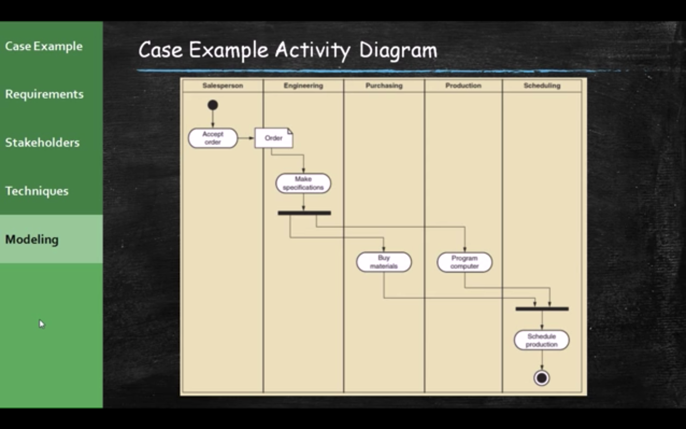

原文： https://www.youtube.com/watch?v=bnbwNe-w2U4&list=PL6XklZATqYx9dj72MKG6wLYjljeB2odra&index=7

### Case Example - Systems Analysis Activities

- The New Consolidated Sales and Marketing System (CSMS) will require **discovering and understanding extensive and complex business processes and business rules.**
- The SDLC indeicates the project starts with **identifying the problem, obtaining approval, and planning the project**(as seen in Chapter 1)
- To get to the heart of systems analysis, this course skips right to **analysis activities** generally and the specifically for the RMO CSMS project

### Systems Analysis Activities - Determine  Requirements

1. Gather Detailed Information
   - Interviews, questionnaires, documents, observing business processes, researching vendors, comments and suggestions.
2. Define Requirements
   - Modeling functional requirements and non-functional requirements
3. Prioritize Requirements
   - Essential, important, vs. nice to have
4. Develop User-Interface Dialogs
   - Flow of interaction between user and system
5. Evaluate Requirements with Users
   - User involvement, feedback, adapt to changes

### What are requirements?

1. **System Requirements = **
   - Functional requirements
   - Non-functional requirements 
2. **Functional Requirements - the activities the system must perform**
   - Business uses, functions the users carry out
   - Use cases in Chapter 1
3. **Non-functional Requirements - other system characteristics**
   - Constraints and performance goals

### FURPS+

- **F**unctional requirements
- **U**sability requirements (how easy it is to use the system)
- **R**eliability requirements (availability of the system)
- **P**erformance requirements (how well the system works, how fast the system is)
- **S**ecurity requirements (the idea of confidentiality and integrity of the data in the system)
- **+**even more categories...

### Stakeholders

- **Stakeholders** - personos who have an interest in the successful implementation of the system
- **Internal Stakeholders** - persons within the organization 
- **External Stakeholders** - persons outside the organization 
- **Operational Stakeholders** - persons who regularly interact with the system
- **Executive Stakeholders** - persons who don`t directly interact, but use the information or have financial interest

test image
 
### Information Gathering Techniques

- **Interviewing** users and other stakeholders
- Distributing and collecting **questionnaires**
- Reviewing inputs, outputs, and documentation
- **Observing** and documenting business procedures
- **Researching** vendor solutions
- **Collecting** active user comments and suggestions

### Interviewing Tips

- **Prepare** detailed questions
- **Meet** with individuals or groups of users
- **Obtain** and discuss answers to the questions
- **Document** the answers
- **Follow up** as needed in future meetings or interviews

### Inputs, Outputs, Procedures

- **SOPs**
- **Reports**
- **Forms**
- **"Artifacts"** (All these stuff collective Artifacts)

**Artifacts** : a customer order form from the catalog, this tells you probably what you need to know the on-line form as well, because you have to capture all the seen information.

### Additional Techniques

- **Observe and Document Business Processes**
  - Watch and learn
  - Document with Activity diagram(Next section)
- **Research Vendor Solutions**
  - See what others have done for similar situations
  - White papers, vendor literature, competitors
- **Collect Active User Comments and Suggestions**
  - Feedback on models and tests
  - Users know it when they see it

### Models and Modeling

- **How do we define requirements?**
  - After collecting information, create models
- **Model** - a representation of some aspect of the system being built
- **Types of Models**
  - **Textual model** - something written down, described
  - **Graphical models** - diagram, schematic
  - **Mathematical models** - formulas, statistics, algorithms
- **Unified Modeling Language (UML)**
  - Standard graphical modeling symbols / terminology used for information systems

### Some Analysis and design models

- These are models we can use to take what we learn in the requirements gathering so **all that stuff that we learned in requirements we use to develop these models.** 

1. **We start with the Use case Diagrams.** Which is a very high level diagram.
2. **We use Use case diagrams to build Class Diagrams.**
3. **Class Diagrams help us create Sequence Diagrams and Activity Diagrams.**

### Documenting Workflows with Activity Diagrams

- **Workflow** - sequence of processing steps that completely handles one business transaction or customer request
- **Activity Diagram** - describes user (or system) activities, the person who does each activity, and the sequential flow of these activities
  - **Useful for showing a graphical model of a workflow***
  - A UML diagram

(ActivityDiagram is like a flow chart)

- **Real Example of Activity Diagram**

### Reasons for Modeling

- **Learning** from the modeling process
  - When you do models, the act of creating these models actually clarifys a lot of this for you. 
  - When you make a model, you really have to understand, know the business process, you have to know what it is that you are analyzing. 
- Reducing complexity by **abstraction**
- **Remembering** all the details
- **Communicating** with other development team members
- Communicating with a variety of users and stakeholders
- **Documenting** what was done for future maintenance / enhancement 
