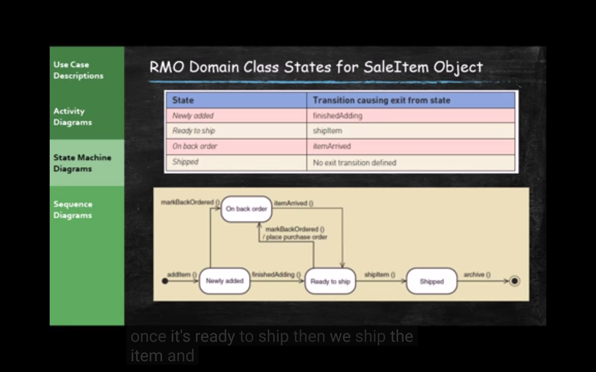
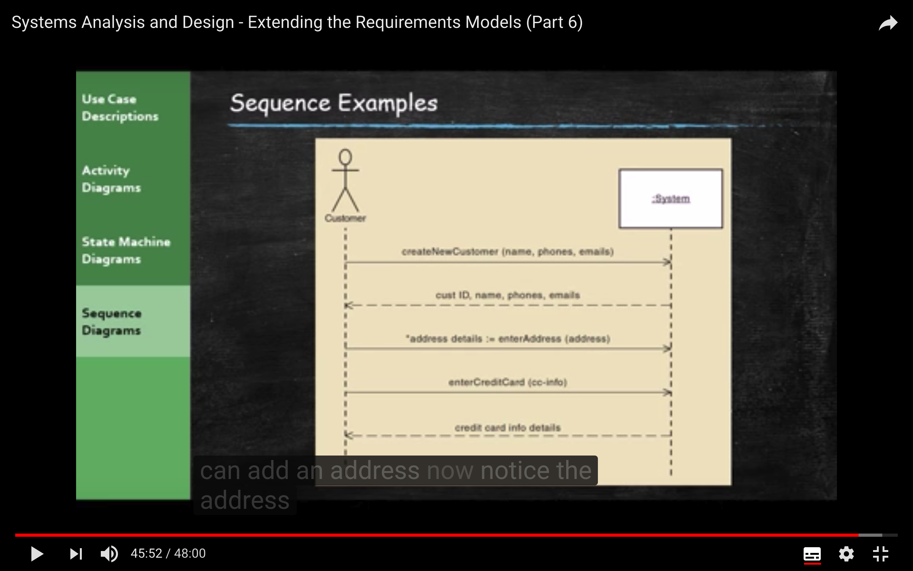
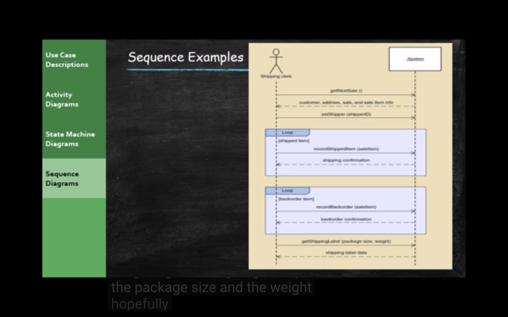

原文： https://www.youtube.com/watch?v=bnbwNe-w2U4&list=PL6XklZATqYx9dj72MKG6wLYjljeB2odra&index=7

**Use case :** define the functional requirements for our system, and also talked about the actors, the things, either people or the system that would interact with our system we are trying to understand or analyze.

**Domain Class Diagram:** which showed all the things that our system has to track up or has to remember. 

**Use case Descriptions**: it is a more descriptive way to define all of the functional requirements of these use cases.

A fully developed Use case Descriptions is gonna be much more in-depth than the brief description we discussed so far for the use cases.

**Activity Diagram:**  take each use case and show a diagram of all the activities that are required to complete the use cases. 

So usually you have to have a use case before you can develop an Activity Diagram, it does help clarify the complex use cases

For the domain class diagram, we can take each class of types of objects and create **State Machine Diagram**. **State Machine** shows all the possible states for an specific instance of an object. So what you do is you take a class(for example **customer**), and **we can show all the states that a customer would transition through.**

**The important thing of the Activity Diagram is decomposing a Use case where a Domain class diagram is decomposing a specific class**.

**Sequence Diagram, you can develop from Activity and State Machine Diagram.** Sequence Diagram is very useful, they give you a lot of insight into how the system works and how people carry out passed within the system.

**We can`t get to the Sequence Diagram until we get through our Use case diagram, our Domain class Diagram use and we can decompose those into Activity and State Machine Diagram, and we can use those to inform our Sequence Diagram.**

### Extending and Integrating Requirements Models

- **Use cases**
  - Use case Diagram - that show how use cases, actor act with each other.
    - Use case descriptions 
    - Activity Diagram - show how you carry out those use cases so what activities are required to complete those use cases, some activities would be things that our actor do, some would happen to be inside  our system
    - System Sequence Diagram(SSD)
- Domain Classes
  - Domain model class diagram
    - State Machine Diagram - we can take those classes and decompose those into a **State Machine Diagram**

**We are discussing analysis, and in analysis phase, we are not designing a system yet. what we`re really trying to do in the phase is understand the system that needs get developed, understand what the current system does or understand what the customers or users or stakeholders needs are for the new system.**

### Use Case Descriptions 

- Write a **brief description **as shown in Unit 2 for **most use cases**

**Fully developed Use Case Descriptions**

### Fully Developed Use Case Descriptions 

- Use case name
  - Verb-noun
- Scenario (if needed)
  - A use case can have more than one scenario (special case or more specific path)
- Triggering event
  - Based on event decomposition technique
- Brief description
  - Written previously when use case was identified
- Actors
  - One or more users from use case diagrams
- Related use cases <include>
  - If one use case invokes or includes another
- Stakeholders
  - Anyone with an interest in the use case
- Perconditions
  - What must be true before the use case begins
- Post conditions
  - What must be true when the use case is completed
  - Use for planning test case expected results
- Flow of activities
  - The activities that go on between actor and the system 
- Exception condition
  - Where and what can go wrong

### Activity Diagram

**Once we complete fully developed Use case Descriptions, we can create Activity Diagram.** You don`t always have to have fully developed Use case Descriptions.

**Activity Diagram **is going to show us in a diagram the activities in order to complete the use case. Sometimes it can offer some clarity on the process to complete the use case.

**Activity Diagram gives us a little more clarity on how are our use case accomplished or what steps in activities both the system and the actor taken in order to complete the use case.** 

**Activity Diagram decomposes use case.**

### State Machine Diagram - Decomposing the Class Diagram or Domain Class Diagram

- **State machine diagram**
  - A **UML** diagram showing the life of an object in states and transaction 
- **State**
  - A **condition** during an **object`s life** when it satisfies some criterion, performs some action, or waits for an event
- **Transition**
  - The **movement** of an object **from one state to another** state
- **Action Expression**
  - A **description of activities** performed as part of a transition
- **Pseudo state**
  - The **starting state** of a state machine diagram(black dot)
- **Origin state**
  - The **original state** of an object before transition
- **Destination state**
  - The state to which the object moves **after the transition**
- **Guard condition**
  - A **true false** test to see whether a transition can fire

 **On-Off button example**

**State Machine Diagram is not showing us different objects, it`s all the state of a single object. So you would not normally have a State Machine Diagram different object, it is all one class, so State Machine is always representing all the state of object in one class**

**So the boxes is not class, it is state of a single class**

### Steps for Developing a State Machine Diagram

1. **Review** the class diagram and select classes that might require state machine diagrams
2. For each class, **make a list of** status conditions(**state**) you can identify
3. Begin building diagram fragments by **identifying transitions** that cause an object to leave the identified state
4. **Sequence** these states in the correct order and aggregate combinations into larger fragments
5. **Review** paths and look for independent, concurrent paths
6. Look for additional transitions and test both directions
7. **Expand** each transition with **appropriate message event, guard condition, and action expression**
8. **Review and test** the state machine diagram for the class
   - Make sure state are really state for the object in the class
   - Follow the life cycle of an object coing into existence and being deleted
   - Be sure the diagram covers all exception condition
   - Look again for concurrent paths and composite states

### System Sequence Diagram (SSD)

In analysis, we would have finish the **Use Case Diagram**, we did **fully developed use case descriptions**, we did **Activity Diagram**, then we went to our **Domain Model, our Class Diagram** basically, and we decompose that into states, and **State Machine Diagram**, and now we have a much better understanding of our system and we can start to build a **Sequence Diagram**, 

- A **UML Sequence diagram** - is how we show the sequence of events and how all of the different objects communicate with one another inside the system and also our use cases our actors how they interact with the system

**In a analysis system sequence diagram in the analysis phase, we`re only looking at the entire system, so we are not going to break this down, we are not going to decompose this much further than just the system in the actors**

**That is really as far as we need to go in a sequence diagram at this level**

**We are going to talk about sequence diagrams in much more detail in the design phase,** in a design sequence diagram is a little different that our system sequence diagram. **System design sequence diagram is all about developing a program at some point, in analysis phase, we`re just trying to understand what that program needs to do.**

**System sequence diagram is not only diagramming how actors interface with our system but remember our actors could be lots of different types of things, could be people, could be other systems.**

**So in complex systems that involve lots of different systems interacting with another system I`ll see sequence diagrams that show how all these different systems talk to each other in order to accomplish a single task**

**A system level sequence diagram helps us understand how all those systems work together**

It shows input, output, messaging requirements for a specific use case.

**So we usually have an actor the system and an object lifeline and then messages that are flowing back and forth between the actor and the system and you can see that on the lifeline.**

- Special case for a sequence diagram
  - Only shows actor and one object
  - The one object represents the complete system
  - Shows input output, messaging requirements for a use case
- **Actor, System, Object lifeline **
- **Message**

### Message Notation for SSD

### Loop Frame for SSD

**For equal sign** :

**On the left side of the equal sign is the description, price that comes back (return value ), but on the right side of the equal sign is what we are sending, the message that we are sending to the system.** In this case, add Item with the item ID in the quantity

### Opt Frame (optional ) if frame

### Alt Frame (if -else)

### Steps for Developing an SSD

- **Identify input message**
  - See use case flow of activities or activity diagram
- **Describe the message from the external actor to the system using the message notation**
  - Name it verb-noun: what the system is asked to do
  - Consider parameters the system will need
- **Identify any special conditions on input messages**
  - Iteration / Loop frame
  - Opt or Alt frame
- **Identify and add output return values**
  - On messages itself: aValue := getValue(ValueID)
  - As explicit return on separate dashed line

### Sequence Examples

**When we do our system design the sequence diagram are going to get a lot more complicated because we are going to try to show the messages between lots of different objects in other words in order to complete this task it is going to require the interaction between different classes in order to complete the task. **

**Eventually
